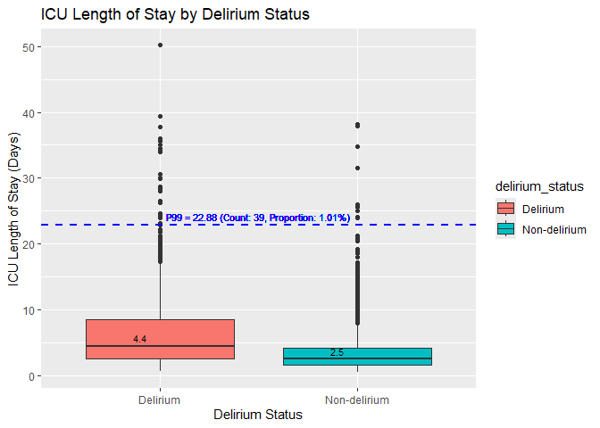

Descriptive Data and Bivariate Analysis
================
Ou Yang Yu
2024-04-14

## Intro

This document provides the descriptive data and bivariate analysis for
final dataset: cohort_w_confounders.csv.

## Load Libraries

``` r
knitr::opts_chunk$set(echo = TRUE, warning = FALSE, message = FALSE)
library(tidyverse)
```

    ## ── Attaching core tidyverse packages ──────────────────────── tidyverse 2.0.0 ──
    ## ✔ dplyr     1.1.4     ✔ readr     2.1.5
    ## ✔ forcats   1.0.0     ✔ stringr   1.5.1
    ## ✔ ggplot2   3.5.0     ✔ tibble    3.2.1
    ## ✔ lubridate 1.9.3     ✔ tidyr     1.3.1
    ## ✔ purrr     1.0.2     
    ## ── Conflicts ────────────────────────────────────────── tidyverse_conflicts() ──
    ## ✖ dplyr::filter() masks stats::filter()
    ## ✖ dplyr::lag()    masks stats::lag()
    ## ℹ Use the conflicted package (<http://conflicted.r-lib.org/>) to force all conflicts to become errors

``` r
library(skimr)
```

## Read final dataset

``` r
### Read final dataset
data <- read_csv("D:\\cohort_w_confounders.csv")
```

## Descriptive Data

### Data Summary

Descriptive data for all 40 variables are in Data Summary.

``` r
### Data Summary
data <- data %>%
  mutate(across(c(subject_id, hadm_id, stay_id), as.character)
         ) %>%
  mutate(
    across(c(delirium, surgical, neurological_condition, dementia), as.logical)
  )

skimr::skim(data)
```

|                                                  |      |
|:-------------------------------------------------|:-----|
| Name                                             | data |
| Number of rows                                   | 3862 |
| Number of columns                                | 40   |
| \_\_\_\_\_\_\_\_\_\_\_\_\_\_\_\_\_\_\_\_\_\_\_   |      |
| Column type frequency:                           |      |
| character                                        | 8    |
| logical                                          | 5    |
| numeric                                          | 27   |
| \_\_\_\_\_\_\_\_\_\_\_\_\_\_\_\_\_\_\_\_\_\_\_\_ |      |
| Group variables                                  | None |

Data summary

**Variable type: character**

| skim_variable  | n_missing | complete_rate | min | max | empty | n_unique | whitespace |
|:---------------|----------:|--------------:|----:|----:|------:|---------:|-----------:|
| subject_id     |         0 |           1.0 |   8 |   8 |     0 |     3862 |          0 |
| hadm_id        |         0 |           1.0 |   8 |   8 |     0 |     3862 |          0 |
| stay_id        |         0 |           1.0 |   8 |   8 |     0 |     3862 |          0 |
| gender         |         0 |           1.0 |   1 |   1 |     0 |        2 |          0 |
| admission_type |         0 |           1.0 |   6 |  27 |     0 |        7 |          0 |
| insurance      |         0 |           1.0 |   5 |   8 |     0 |        3 |          0 |
| marital_status |       402 |           0.9 |   6 |   8 |     0 |        4 |          0 |
| race           |         0 |           1.0 |   5 |  41 |     0 |       33 |          0 |

**Variable type: logical**

| skim_variable          | n_missing | complete_rate | mean | count                |
|:-----------------------|----------:|--------------:|-----:|:---------------------|
| delirium               |         0 |          1.00 | 0.33 | FAL: 2573, TRU: 1289 |
| sepsis3                |      1333 |          0.65 | 1.00 | TRU: 2529            |
| surgical               |         0 |          1.00 | 0.65 | TRU: 2498, FAL: 1364 |
| neurological_condition |         1 |          1.00 | 0.05 | FAL: 3684, TRU: 177  |
| dementia               |         0 |          1.00 | 0.02 | FAL: 3775, TRU: 87   |

**Variable type: numeric**

| skim_variable          | n_missing | complete_rate |  mean |     sd |    p0 |   p25 |   p50 |   p75 |    p100 | hist  |
|:-----------------------|----------:|--------------:|------:|-------:|------:|------:|------:|------:|--------:|:------|
| duration_hours         |         0 |          1.00 | 23.96 |  37.05 |  0.02 |  4.00 | 10.50 | 27.17 |  358.63 | ▇▁▁▁▁ |
| icu_length_of_stay_day |         0 |          1.00 |  4.50 |   4.51 |  0.54 |  1.93 |  3.08 |  5.20 |   50.18 | ▇▁▁▁▁ |
| age                    |         0 |          1.00 | 66.96 |  14.66 | 18.00 | 58.00 | 68.00 | 78.00 |   96.00 | ▁▂▅▇▃ |
| weight                 |        15 |          1.00 | 86.83 |  22.87 | 20.00 | 71.00 | 84.00 | 99.10 |  254.00 | ▂▇▁▁▁ |
| avg_dose               |        25 |          0.99 |  2.41 |  20.11 |  0.30 |  1.27 |  1.80 |  2.39 | 1020.03 | ▇▁▁▁▁ |
| max_dose               |        25 |          0.99 |  6.99 | 143.50 |  0.30 |  1.80 |  2.42 |  3.54 | 8147.63 | ▇▁▁▁▁ |
| apsiii_score           |         0 |          1.00 | 45.00 |  21.78 |  6.00 | 29.00 | 40.00 | 56.00 |  184.00 | ▇▆▁▁▁ |
| apsiii_prob            |         0 |          1.00 |  0.13 |   0.14 |  0.02 |  0.04 |  0.07 |  0.14 |    0.99 | ▇▁▁▁▁ |
| age_score              |         0 |          1.00 |  4.23 |   1.85 |  0.00 |  3.00 |  5.00 |  6.00 |    6.00 | ▁▂▃▁▇ |
| chs_score              |      2815 |          0.27 |  4.78 |   0.78 |  2.00 |  5.00 |  5.00 |  5.00 |    5.00 | ▁▁▁▁▇ |
| hr_score               |         0 |          1.00 |  2.57 |   3.62 |  0.00 |  0.00 |  1.00 |  5.00 |   17.00 | ▇▂▂▁▁ |
| mbp_score              |         0 |          1.00 | 11.52 |   4.89 |  0.00 |  7.00 | 15.00 | 15.00 |   23.00 | ▁▇▁▇▁ |
| temp_score             |       349 |          0.91 |  1.26 |   3.00 |  0.00 |  0.00 |  0.00 |  2.00 |   20.00 | ▇▁▁▁▁ |
| resp_rate_score        |         2 |          1.00 |  3.58 |   3.81 |  0.00 |  0.00 |  6.00 |  6.00 |   18.00 | ▇▆▂▁▁ |
| pao2_aado2_score       |      1266 |          0.67 |  0.78 |   2.77 |  0.00 |  0.00 |  0.00 |  0.00 |   15.00 | ▇▁▁▁▁ |
| hematocrit_score       |         4 |          1.00 |  2.89 |   0.56 |  0.00 |  3.00 |  3.00 |  3.00 |    3.00 | ▁▁▁▁▇ |
| wbc_score              |         4 |          1.00 |  0.76 |   1.82 |  0.00 |  0.00 |  0.00 |  0.00 |   19.00 | ▇▁▁▁▁ |
| creatinine_score       |         2 |          1.00 |  1.79 |   2.91 |  0.00 |  0.00 |  0.00 |  4.00 |   10.00 | ▇▂▁▂▁ |
| uo_score               |        37 |          0.99 |  4.07 |   3.71 |  0.00 |  0.00 |  4.00 |  5.00 |   15.00 | ▆▇▂▁▁ |
| bun_score              |         2 |          1.00 |  4.50 |   4.10 |  0.00 |  0.00 |  7.00 |  7.00 |   12.00 | ▇▁▆▁▂ |
| sodium_score           |         7 |          1.00 |  0.44 |   0.87 |  0.00 |  0.00 |  0.00 |  0.00 |    4.00 | ▇▁▂▁▁ |
| albumin_score          |      2455 |          0.36 |  1.50 |   3.03 |  0.00 |  0.00 |  0.00 |  0.00 |   11.00 | ▇▁▁▁▁ |
| bilirubin_score        |      2072 |          0.46 |  2.34 |   4.56 |  0.00 |  0.00 |  0.00 |  5.00 |   16.00 | ▇▂▁▁▁ |
| glucose_score          |         0 |          1.00 |  1.34 |   2.01 |  0.00 |  0.00 |  0.00 |  3.00 |    9.00 | ▇▃▁▁▁ |
| acidbase_score         |       263 |          0.93 |  3.74 |   3.58 |  0.00 |  1.00 |  3.00 |  5.00 |   12.00 | ▇▅▃▁▂ |
| gcs_score              |        83 |          0.98 |  4.91 |  12.16 |  0.00 |  0.00 |  0.00 |  0.00 |   48.00 | ▇▁▁▁▁ |
| vent_duration_hrs      |         0 |          1.00 | 78.39 |  86.22 |  0.42 | 27.57 | 51.00 | 92.48 |  914.07 | ▇▁▁▁▁ |

### Mapping delirium 1 and 0 to Delirium and Non-delirium

``` r
### Mapping delirium 1 and 0 to Delirium and Non-delirium
data_mod <- data %>%
  mutate(delirium_status = ifelse(delirium == 1, "Delirium", "Non-delirium"),
         delirium_status = as.factor(delirium_status))
```

### Proportion of Delirium Status in ICU Patients with ARDS (Pie Chart)

Figure shows that out of a total of 3,862 patients, 1,289 patients
(approx. 33.4%) were diagnosed with delirium during their ICU stay,
while 2,573 patients (approx. 66.6%) did not develop delirium. The high
incidence of delirium (1/3 of patients) suggests the need for monitoring
strategies or protocols aimed at reducing the incidence and severity of
delirium.

``` r
### Proportion of Delirium Status in ICU Patients with ARDS (Pie Chart)

delirium_table <- table(data_mod$delirium_status)
delirium_prop <- prop.table(delirium_table) # Proportion of cases with and without delirium

# Prepare data for the pie chart
data_pie <- as.data.frame(delirium_table)
names(data_pie) <- c("delirium_status", "count")
data_pie$prop <- delirium_prop * 100  # convert proportion to percentage

# Creating the pie chart
ggplot(data_pie, aes(x = "", y = prop, fill = delirium_status)) + 
  geom_bar(stat = "identity", width = 1, color = "white") +
  coord_polar(theta = "y") +  # This makes it a pie chart
  theme_void() +  # Removes background and grid lines
  labs(fill = "Delirium Status",
       title = "Proportion of Delirium Status in ICU Patients with ARDS") +
  geom_text(aes(label = paste(count, sprintf("(%.1f%%)", prop))), position = position_stack(vjust = 0.5))  # Adds text labels with count and percentage
```

<!-- -->

### Histogram of Propofol Infusion Duration

The histogram in Figure, which is right-skewed, shows that while most
ARDS patients receive shorter durations of propofol infusion, a long
tail indicates that some receive it for much longer. This suggests that,
although shorter durations are typical, specific conditions or
complications may necessitate longer durations. The histogram is tall
and narrow, with most data clustered around the mean, yet it spans a
wide range, indicating significant variability in infusion durations.
Gaps at the extremes highlight the presence of outliers. Additionally,
the histogram does not account for variations in medical need, such as
ARDS severity, which may require longer sedation durations for more
severe cases.

``` r
### Histogram of Propofol Infusion Duration

# Calculate the 99th percentile of propofol infusion duration
p99_duration <- quantile(data_mod$duration_hours, 0.99)

# Calculate count and proportion of durations >= P99
count_p99_duration <- sum(data_mod$duration_hours >= p99_duration)
proportion_p99_duration <- count_p99_duration / nrow(data_mod)

# Histogram of Propofol Infusion Duration with P99 indicator and annotations
ggplot(data_mod, aes(x = duration_hours)) +
  geom_histogram(bins = 30, fill = "#008080", color = "black") +
  labs(title = "Histogram of Propofol Infusion Duration", x = "Propofol Infusion Duration (Hours)", y = "Frequency") +
  geom_vline(aes(xintercept = p99_duration), color = "blue", linetype = "dashed", size = 1) +
  geom_text(aes(x = p99_duration, y = Inf), 
            label = sprintf("P99 = %.2f (Count: %d, Proportion: %.2f%%)", p99_duration, count_p99_duration, 100 * proportion_p99_duration),
            vjust = 1.5, hjust = -0.01, color = "blue", size = 3)  # Add text label for P99 with count and proportion
```

<!-- -->

## Bivariate Analysis

The bivariate visualisation below serves a distinct purpose but
collectively offers a comprehensive view of the central tendencies,
variability, and relationships among factors such as age, ICU stay,
delirium status, sedation duration, and disease severity in the ICU ARDS
study population.

### Box Plot of Age Distribution by Delirium Status

Age may affect delirium risk in ARDS patients. According to the boxplot
in Figure, the median age is slightly higher in the delirium group,
suggesting that older patients are more prone to delirium. Both groups
show similar box sizes, indicating low age variability within delirium
and non-delirium patients. This implies that the risk of delirium does
not vary significantly with age among those susceptible to ARDS,
pointing to other factors like ARDS severity or propofol duration as
potential influencers. Outliers below the whiskers in the delirium
group, including notably young patients around 25 years old, suggest
that there are exceptional cases where younger individuals develop
delirium.

``` r
### Age Distribution by Delirium Status

# Calculate the 99th percentile of age
p99_age <- quantile(data_mod$age, 0.99)

# Determine the count of cases at or above the 99th percentile
count_p99_age <- sum(data_mod$age >= p99_age)

# Calculate the proportion of cases at or above the 99th percentile
proportion_p99_age <- count_p99_age / nrow(data_mod)

# Box Plot of Age by Delirium Status with annotations for P99, median, and IQR
ggplot(data_mod, aes(x = delirium_status, y = age, fill = delirium_status)) +
  geom_boxplot() +
  labs(title = "Age Distribution by Delirium Status", x = "Delirium Status", y = "Age") +
  geom_hline(aes(yintercept = p99_age), color = "blue", linetype = "dashed", size = 1) +
  geom_text(aes(x = 1.5, y = p99_age, 
                label = sprintf("P99 = %d (Count: %d, Proportion: %.2f%%)", p99_age, count_p99_age, 100 * proportion_p99_age)),
            color = "blue", vjust = -0.5, hjust = 0.5, size = 3) +  # Adjust size for smaller text
  stat_summary(fun = median, geom = "text", aes(label = round(..y.., 1)), vjust = -0.5, hjust = 2, size = 3, color = "black") +
  stat_summary(fun = quantile, fun.args = list(probs = c(0.25, 0.75)), geom = "text", aes(label = round(..y.., 1)), vjust = -0.5, hjust = 2, size = 3, color = "black")
```

<!-- -->

``` r
# Statistical Test
t.test(age ~ delirium_status, data = data_mod)
```

    ## 
    ##  Welch Two Sample t-test
    ## 
    ## data:  age by delirium_status
    ## t = 3.0147, df = 2564.4, p-value = 0.002597
    ## alternative hypothesis: true difference in means between group Delirium and group Non-delirium is not equal to 0
    ## 95 percent confidence interval:
    ##  0.5275543 2.4908390
    ## sample estimates:
    ##     mean in group Delirium mean in group Non-delirium 
    ##                   67.96742                   66.45822

### Box Plot of ICU Length of Stay by Delirium Status

The boxplot in Figure shows that the delirium group has a higher median,
indicating longer ICU stays on average. The taller box in the delirium
group suggests greater variability in ICU lengths of stay. Additionally,
points above the whiskers in both groups reveal many outliers with
extended ICU stays.

``` r
### Box Plot of ICU Length of Stay by Delirium Status

# Calculate the 99th percentile of ICU Length of Stay
p99_los <- quantile(data_mod$icu_length_of_stay_day, 0.99)

# Calculate count and proportion of ICU Length of Stay >= P99
count_p99_los <- sum(data_mod$icu_length_of_stay_day >= p99_los)
proportion_p99_los <- count_p99_los / nrow(data_mod)

# Box plot
ggplot(data_mod, aes(x = delirium_status, y = icu_length_of_stay_day)) +
  geom_boxplot(aes(fill = delirium_status)) +
  labs(title = "ICU Length of Stay by Delirium Status",
       x = "Delirium Status",
       y = "ICU Length of Stay (Days)") +
  geom_hline(aes(yintercept = p99_los), color = "blue", linetype = "dashed", size = 1) +
  geom_text(aes(x = 1.5, y = p99_los, label = sprintf("P99 = %.2f (Count: %d, Proportion: %.2f%%)", p99_los, count_p99_los, 100 * proportion_p99_los)),
            vjust = -0.5, hjust = 0.5, color = "blue", size = 3) +  # Correct variable and adjusted positions
  stat_summary(fun = quantile, fun.args = list(probs = c(0.5)), geom = "text", 
               aes(label = round(..y.., 1)), vjust = -0.5, hjust = 2, size = 3, color = "black")
```

<!-- -->

``` r
# Statistical Test
t.test(icu_length_of_stay_day ~ delirium_status, data = data_mod)
```

    ## 
    ##  Welch Two Sample t-test
    ## 
    ## data:  icu_length_of_stay_day by delirium_status
    ## t = 16.916, df = 1694.3, p-value < 2.2e-16
    ## alternative hypothesis: true difference in means between group Delirium and group Non-delirium is not equal to 0
    ## 95 percent confidence interval:
    ##  2.618790 3.305722
    ## sample estimates:
    ##     mean in group Delirium mean in group Non-delirium 
    ##                   6.473888                   3.511632

### Box Plot of Propofol Duration by Delirium Status

The boxplot in Figure shows that ARDS patients with delirium have a
higher median propofol duration, indicating a possible association with
increased delirium incidence. This group also displays a taller box,
signifying greater variability in propofol duration and suggesting that
the relationship between propofol use and delirium may be influenced by
patient-specific factors such as pre-existing health conditions,
response to sedation, and ARDS severity. Additionally, numerous outliers
above the whiskers in both groups indicate that some patients received
exceptionally long propofol durations, warranting further investigation
into their specific circumstances.

``` r
### Box Plot of Propofol Duration by Delirium Status

ggplot(data_mod, aes(x = delirium_status, y = duration_hours, fill = delirium_status)) +
  geom_boxplot() +
  labs(title = "Propofol Infusion Duration by Delirium Status", x = "Delirium Status", y = "Propofol Infusion Duration (Hours)") +
  geom_hline(aes(yintercept = p99_duration), color = "blue", linetype = "dashed", size = 1) +
  geom_text(aes(x = 1.5, y = p99_duration, label = sprintf("P99 = %.2f (Count: %d, Proportion: %.2f%%)", p99_duration, count_p99_duration, 100 * proportion_p99_duration)),
            vjust = -0.5, hjust = 0.5, color = "blue", size = 3)+  # Adjusted vjust and hjust for better positioning
  stat_summary(fun = quantile, fun.args = list(probs = c(0.5)), geom = "text", aes(label = round(..y.., 1)), vjust = -0.5, hjust = 2, size = 3, color = "black")
```

<!-- -->

``` r
# Statistical Test
t.test(duration_hours ~ delirium_status, data = data_mod)
```

    ## 
    ##  Welch Two Sample t-test
    ## 
    ## data:  duration_hours by delirium_status
    ## t = 14.742, df = 1719.7, p-value < 2.2e-16
    ## alternative hypothesis: true difference in means between group Delirium and group Non-delirium is not equal to 0
    ## 95 percent confidence interval:
    ##  18.45528 24.11954
    ## sample estimates:
    ##     mean in group Delirium mean in group Non-delirium 
    ##                   38.13909                   16.85168

### Scatter Plots of Propofol Duration vs. APACHE III Score

Severity of illness may influence the duration of propofol use. The
scatterplot in Figure shows a positive, upward-sloping regression line,
indicating that higher APACHE III scores correlate with longer propofol
infusions, suggesting sicker patients may require extended sedation. The
data points, both tightly clustered and widely scattered, demonstrate a
linear relationship and variability among patients with similar scores,
indicating other factors also influence propofol usage. Most delirium
cases (red points) cluster at higher durations and scores, suggesting
prolonged sedation and severity may increase delirium risk. A
logarithmic transformation normalises the skewed distributions of both
propofol duration and APACHE III scores, reducing outlier impact.

``` r
### Scatter Plot of Propofol Duration vs. APACHE III Score

# Scatter plot with regression line
ggplot(data_mod, aes(x = apsiii_score, y = duration_hours)) +
  geom_point(aes(color = delirium_status), alpha = 0.6) +  # Points colored by delirium status
  geom_smooth(method = "lm", color = "blue", se = FALSE) + # Linear regression line
  labs(title = "Scatter Plot of Propofol Duration vs. APACHE III Score",
       x = "APACHE III Score",
       y = "Propofol Infusion Duration (Hours)") +
  theme_minimal()
```

<!-- -->

``` r
# Scatter plot with regression line (with Log)
ggplot(data_mod, aes(x = apsiii_score, y = duration_hours)) +
  geom_point(aes(color = delirium_status), alpha = 0.6) +  # Points colored by delirium status
  geom_smooth(method = "lm", color = "blue", se = FALSE) + # Linear regression line
  labs(title = "Scatter Plot of Propofol Duration vs. APACHE III Score",
       x = "APACHE III Score",
       y = "Propofol Infusion Duration (Hours)") +
  scale_y_log10()+
  scale_x_log10()+
  theme_minimal()
```

<!-- -->

## \_\_\_\_\_\_\_\_\_\_\_\_\_\_\_\_\_\_\_\_\_\_\_\_\_\_\_\_\_\_\_\_\_\_\_\_\_\_\_\_\_\_\_\_\_

## Un-used Charts

### Density Plot of Propofol Duration (Un-used)

``` r
### Density Plot of Propofol Duration (Un-used)

ggplot(data_mod, aes(x=duration_hours, fill=delirium_status)) +
  geom_density(alpha=0.5) +
  labs(title="Density Plot of Propofol Duration by Delirium Status", x="Duration in Hours", y="Density")
```

<!-- -->

### Box Plot APACHE III Score by Delirium Status (Un-used)

``` r
### Box Plot APACHE III Score by Delirium Status (Un-used)

# Calculate the 99th percentile of apsiii
p99_apsiii <- quantile(data_mod$apsiii_score, 0.99)

# Calculate count and proportion of apsiii >= P99
count_p99_apsiii <- sum(data_mod$apsiii_score >= p99_apsiii)
proportion_p99_apsiii <- count_p99_apsiii / nrow(data_mod)

ggplot(data_mod, aes(x = delirium_status, y = apsiii_score, fill = delirium_status)) +
  geom_boxplot() +
  labs(title = "APACHE III Score by Delirium Status", x = "Delirium Status", y = "APACHE III Score") +
  geom_hline(aes(yintercept = p99_apsiii), color = "blue", linetype = "dashed", size = 1) +
  geom_text(aes(x = 1.5, y = p99_apsiii, label = sprintf("P99 = %d (Count: %d, Proportion: %.2f%%)", p99_apsiii, count_p99_apsiii, 100 * proportion_p99_apsiii)),
            vjust = -0.5, hjust = 0.5, color = "blue", size = 3) +  # Correct variable and adjusted positions
  stat_summary(fun = quantile, fun.args = list(probs = c(0.5)), geom = "text", 
               aes(label = round(..y.., 1)), vjust = -0.5, hjust = 2, size = 3, color = "black")
```

<!-- -->

``` r
# Statistical Test
t.test(apsiii_score ~ delirium_status, data = data_mod)
```

    ## 
    ##  Welch Two Sample t-test
    ## 
    ## data:  apsiii_score by delirium_status
    ## t = 7.6547, df = 2484.8, p-value = 2.755e-14
    ## alternative hypothesis: true difference in means between group Delirium and group Non-delirium is not equal to 0
    ## 95 percent confidence interval:
    ##  4.257973 7.190853
    ## sample estimates:
    ##     mean in group Delirium mean in group Non-delirium 
    ##                   48.81691                   43.09250

### Scatter Plot of Propofol Duration vs. Age (Un-used)

``` r
### Scatter Plot of Propofol Duration vs. Age (Un-used)

ggplot(data_mod, aes(x=age, y=duration_hours)) +
  geom_point(aes(color=delirium_status), alpha=0.5) +
  geom_smooth(method = "lm", se = FALSE, color="black") +  # Add a LOESS smoothing line without the confidence interval shaded
  labs(title="Scatter Plot of Propofol Duration vs. Age", x="Age", y="Propofol Infusion Duration (Hours)") +
  scale_color_manual(values=c("Delirium"="red", "Non-delirium"="blue")) +
  #scale_x_log10() +
  scale_y_log10() +  # Logarithmic transformation on the y-axis
  theme_minimal()
```

<!-- -->

## The End
